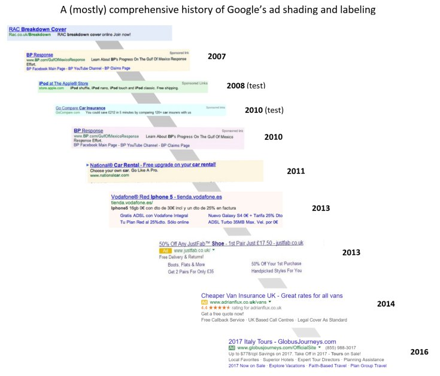
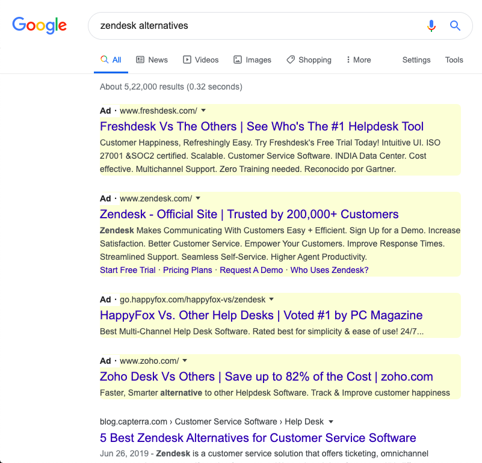

# Highlight Ads on Google Search Results

This simple extension to highlight the ads in Google search results.

> ## Google’s ads just look like search results now

You might have noticed that Google slowly changed how they present ads in the search result. Now it is very difficult to differentiate an ad from an organic search result.

_source(https://twitter.com/GinnyMarvin/status/757606109322633216)_

You can read more about it on TechCrunch:
https://techcrunch.com/2020/01/23/squint-and-youll-click-it/

## What can we do? Write a plugin to highlight ads again!

Yes, its really easy to write a chrome extension to highlight the ads on Google search results, so that you can easily identify the ads from organic results. Just like this:

## Isn't it easier to use some existing extension for this?

Yes, it is. But not a lot.  
Also, why should you trust someone else to inject random code into your browser while you could do it in a couple of minutes?

You just need 2 files.

1. [manifest.json](https://github.com/rohithb/highlight-ads-on-google-search-result/blob/master/manifest.json)
2. A css file with required styles. ([styles.css](https://github.com/rohithb/highlight-ads-on-google-search-result/blob/master/src/styles.css))

Refer the files on [github](https://github.com/rohithb/highlight-ads-on-google-search-result) for better understanding.

## Installing the extension

To install an unpacked extension:

1. Open the Extension Management page by navigating to **chrome://extensions**.  
   (The Extension Management page can also be opened by clicking on the Chrome menu, hovering over More Tools then select Extensions.)
2. Enable Developer Mode by clicking the toggle switch next to Developer mode.
3. Click the **LOAD UNPACKED** button and select the extension directory.

## Warning

Since we are following a very simple approach, if Google changes the class names for the ads, the extension will stop working. But don't worry. Just open the inspect elements tool and update the class name in the css file with the new one.
